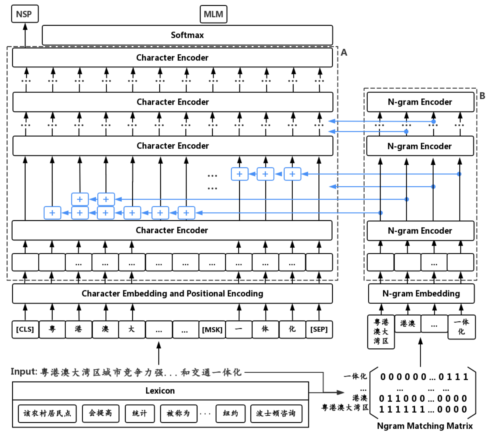

# ZEN

ZEN is a BERT-based Chinese **(Z)** text encoder **E**nhanced by **N**-gram representations, where different combinations of characters are considered during training. The potential word or phrase boundaries are explicitly pre-trained and fine-tuned with the character encoder (BERT), so that ZEN incorporates the comprehensive information of both the character sequence and words or phrases it contains. The structure of ZEN is illustrated in the figure below.

　



　
## Citation

If you use or extend our work, please cite the following [**paper**](https://aclanthology.org/2020.findings-emnlp.425) published in EMNLP-2020:
```
@inproceedings{diao-etal-2020-zen,
    title = "ZEN: Pre-training Chinese Text Encoder Enhanced by N-gram Representations",
    author = "Diao, Shizhe and Bai, Jiaxin and Song, Yan and Zhang, Tong and Wang, Yonggang",
    booktitle = "Findings of the Association for Computational Linguistics: EMNLP 2020",
    month = nov,
    year = "2020",
    address = "Online",
    pages = "4729--4740",
}
```


## Quick tour of pre-training and fine-tune using ZEN

The library comprises several example scripts for conducting [**Chinese NLP tasks**](/datasets):

- `run_pre_train.py`: an example pre-training ZEN
- `run_sequence_level_classification.py`: an example fine-tuning ZEN on DC, SA, SPM and NLI tasks (*sequence-level classification*)
- `run_token_level_classification.py`: an example fine-tuning ZEN on CWS, POS and NER tasks (*token-level classification*)


[**Examples**](/examples) of pre-training and fine-tune using ZEN.


## Contact information

For help or issues using ZEN, please submit a GitHub issue.

For personal communication related to ZEN, please contact Yuanhe Tian (`yhtian94@gmail.com`).

